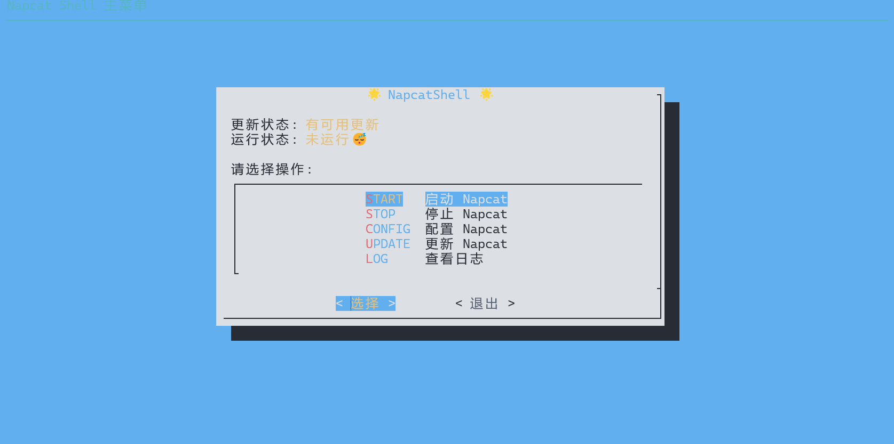

# NapCat-TUI-CLI
Linux下使用船新的交互式 Shell Tui 来管理 NapCat    
   


## 安装
只需要在使用`Linux 一键安装脚本的时候`同意安装`CLI`或者传参`--cli y`即可。详细步骤可以参考[官方文档](https://napneko.github.io/guide/boot/Shell#napcat-installer-linux%E4%B8%80%E9%94%AE%E4%BD%BF%E7%94%A8%E8%84%9A%E6%9C%AC-%E6%94%AF%E6%8C%81ubuntu-20-debian-10-centos9)

## 使用
只需要水灵灵地输入
``` bash
sudo napcat
```
即可进入交互式 Shell Tui 界面，使用`↑↓←→`键来选择，使用`Enter`键来**确认**，使用`空格键`来**选中/取消**，使用`Esc`键来返回上一级菜单。    



