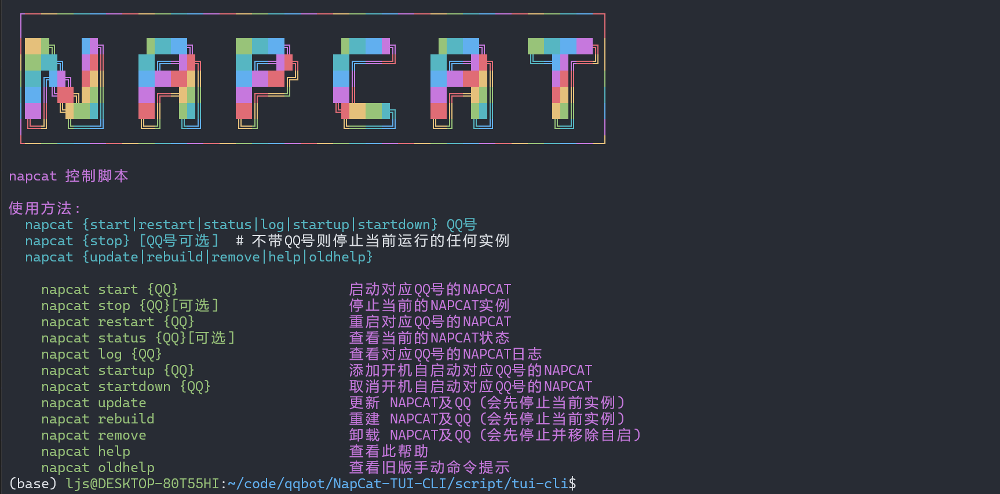

# NapCat-TUI-CLI
Linux下使用船新的交互式 Shell Tui 来管理 NapCat    
   


## 安装
只需要在使用`Linux 一键安装脚本的时候`同意安装`CLI`或者传参`--cli y`即可。详细步骤可以参考[官方文档](https://napneko.github.io/guide/boot/Shell#napcat-installer-linux%E4%B8%80%E9%94%AE%E4%BD%BF%E7%94%A8%E8%84%9A%E6%9C%AC-%E6%94%AF%E6%8C%81ubuntu-20-debian-10-centos9)

## 使用
只需要水灵灵地输入
``` bash
sudo napcat
```
即可进入交互式 Shell Tui 界面，使用`↑↓←→`键来选择，使用`Enter`键来**确认**，使用`空格键`来**选中/取消**，使用`Esc`键来返回上一级菜单。    


## 旧版本CLI兼容
你只需要在`napcat`后面加上参数,就不会使用TUI而是使用`CLI`命令了,当然为了适配TUI,纯命令`CLI`会**严格执行单例模式**.  
``` bash
sudo napcat help
sudo napcat start {QQ}
napcat log {QQ}
```
  




---


## 一些常见问题的解决方案:
### 1. 执行`napcat`界面显示乱码
这个问题常出现在docker环境或者全新的系统. 有可能你的终端或者linux环境不支持中文导致的. 对于linux环境问题, 你可以尝试下面的解决方法.
**解决方法:**
``` shell
sudo apt update
sudo apt install locales
sudo dpkg-reconfigure locales
```
- apt install locales 会安装本地化配置工具包。

- dpkg-reconfigure locales 会弹出交互界面，允许你：
   1. 勾选 zh_CN.UTF-8 UTF-8（以及其他需要的 UTF‑8 locale），
   2. 然后选择哪个为系统默认。
      这个过程依赖于 /etc/locale.gen 中被注释掉的条目和 /etc/default/locale 的实时更新 
