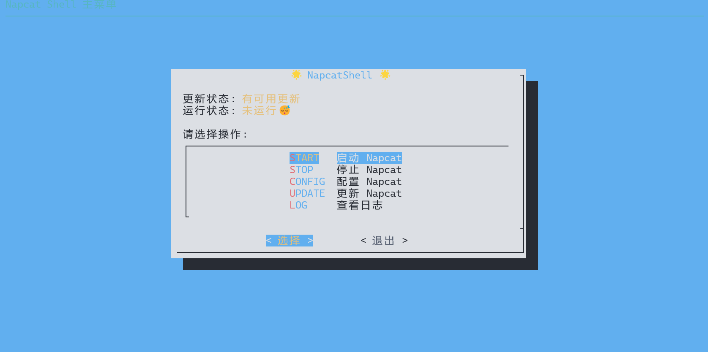

# NapCat-TUI-CLI

在 Linux 终端中管理 NapCat 的安装、更新和运行。

## 安装与使用

[安装 Shell](https://napneko.github.io/guide/boot/Shell#linux) 时添加 `--cli y`。随后使用安装 NapCat 的用户运行：

```bash
napcat
```

方向键选择，Enter 确认，空格勾选，Esc 返回。终端和系统 locale 需支持 UTF-8。



也可直接使用命令：

```bash
napcat help
napcat start 123456789
napcat log 123456789
```

## License

This project is licensed under the Creative Commons Attribution-NonCommercial 4.0 International License. You can view the full license [here](LICENSE).
根据该License严禁将该仓库用于任何商用目的。
任何商用产生的利益纠纷与本项目无关。

